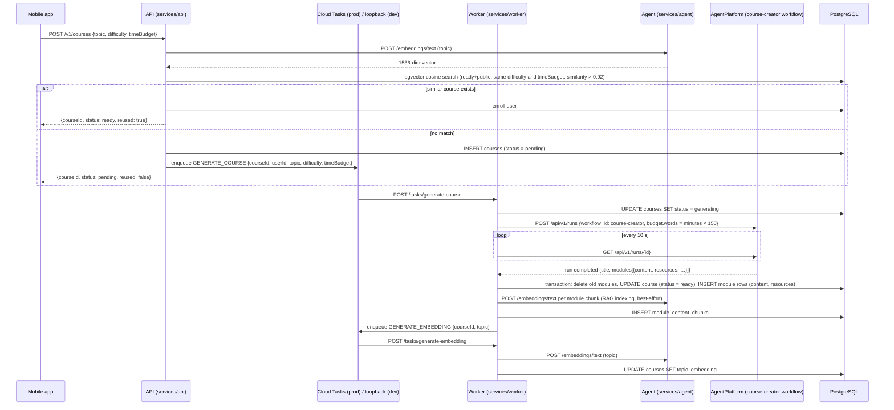
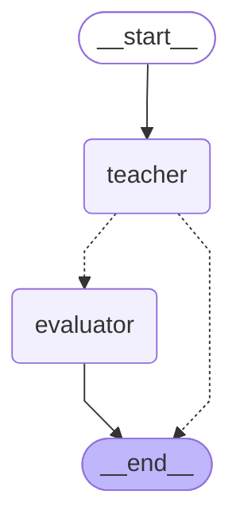

# Agent graphs — course flow (audit)

> Discovery audit for issue #88 (parent #84). Describes the system **as it exists today** — no proposed redesign. Verified against source on 2026-09-01; course generation moved to AgentPlatform under ADR-030.

The Agent service (`services/agent`) runs exactly one LangGraph graph. Course generation is a run on AgentPlatform's `course-creator` workflow (its `docs/architecture/course-creator.md`, in `~/AgentPlatform`) instead — see the end-to-end call path below.

| Graph | Nodes | Checkpointer | Entry route |
|---|---|---|---|
| module-chat | 2 (`teacher`, `evaluator`) | required (`ICheckpointerProvider`) | `POST /module-chat/stream` (SSE) |

Source of truth: `services/agent/src/graphs/module-chat/{graph,nodes,state}.ts`. Invariants live in the sibling `AGENTS.md` files — this doc describes, those files bind.

---

## End-to-end call path: API → Worker → AgentPlatform

Course generation is asynchronous and queue-driven. The mobile app never talks to the Agent or the platform; the Agent is internal-only (port 3001), the platform is reachable from dev only until it is hosted.



Key files per hop:

- API: `services/api/src/modules/courses/courses.service.ts` (`createOrReuse` — embedding, similarity reuse, insert `pending`, enqueue)
- Worker: `services/worker/src/processors/course-generation.processor.ts` (status lifecycle, ready-transaction, RAG indexing, follow-up enqueue); retry semantics in `services/worker/src/processors/AGENTS.md`
- Platform client: `services/worker/src/services/agent-platform.client.ts` (creates the run, polls it, parses the output with `GeneratedCourseSchema`)
- RAG indexing (post-generation, tutoring only): `services/worker/src/rag/index-chunks.ts`

Status lifecycle (writer in parentheses): `pending` (API) → `generating` (Worker) → `ready` (Worker, inside the module-insert transaction) or `failed` (Worker, final task attempt only).

---

## module-chat graph

`services/agent/src/graphs/module-chat/graph.ts`

Stateful multi-turn tutoring graph, checkpointed per session (`thread_id` = request `sessionId`; PostgreSQL checkpointer in prod, memory in dev via `CHECKPOINTER`).

### Auto-generated diagram

Output of `graph.getGraph().drawMermaid()` on the compiled graph — this one is complete as rendered:



Conditional after `teacher`: `state.completionSignaled === true` → `evaluator`, else `END`.

### State shape (`state.ts`)

| Field | Type | Role |
|---|---|---|
| `messages` | `BaseMessage[]` | Full history; append-only via `messagesStateReducer` |
| `moduleBlueprint` | `CourseModule` | Current module context (id, objectives, content) |
| `courseProgress` | `CourseProgressContext` | Course title + completed/total module counts |
| `completionSignaled` | `boolean` | Set by teacher on `[MODULE_COMPLETE:score=N]` detection |
| `completionScore` | `number \| null` | Preliminary score from marker; refined by evaluator |
| `teachingPhase` | `'introduction' \| 'teaching' \| 'evaluation'` | Set to `'evaluation'` on completion signal |

### Node: `teacher` (`nodes.ts`)

1. Optional RAG grounding (ADR-024, gated by `RAG_ENABLED`): retrieves top-4 `module_content_chunks` for the latest learner message via `ContentRetriever`; best-effort — any failure falls back to the un-grounded prompt.
2. System prompt: `buildModuleSystemPrompt(moduleBlueprint, courseProgress, retrievedContext?)`.
3. One LLM call via `invokeModel()` with `[system, ...messages]` — the **entire conversation history every turn** (no truncation or summarisation).
4. Scans output for `[MODULE_COMPLETE:score=N]`; if found, strips the marker (users must never see it), returns `completionSignaled: true`, `completionScore`, `teachingPhase: 'evaluation'`; else appends the `AIMessage` with `completionSignaled: false`.

Only teacher tokens stream to the client — the route (`src/routes/module-chat.ts`, SSE protocol source of truth) filters `streamMode: 'messages'` events on `langgraph_node === 'teacher'`.

### Node: `evaluator` (`nodes.ts`)

Runs only when completion is signaled. One LLM call: `COMPLETION_EVALUATOR_SYSTEM_PROMPT` + **full message history again** + `buildCompletionEvaluatorPrompt(objectives)`. Parses `{completed, score, feedback}` JSON; on parse failure falls back to `completionScore ?? 75`. Its raw JSON never reaches the SSE stream (node-name filter above).

### Model calls & cost profile

- Normal turn: **1 LLM call** (teacher) + optionally 1 embedding call (RAG query embedding inside the retriever).
- Completion turn: **2 LLM calls** (teacher + evaluator), both carrying the full history.
- **Hotspot: unbounded history growth** — every turn re-sends the whole conversation, so per-turn input tokens grow linearly with session length; the completion turn pays it twice.

---

## Embedding call sites (not graphs, but part of the flow's LLM spend)

`POST /embeddings/text` (OpenAI text-embedding-3-small, 1536-dim) is called from:

1. API `createOrReuse` — 1 call per course-creation request (similarity reuse gate).
2. Worker RAG indexing — 1 call **per module chunk**, sequentially, after generation (`index-chunks.ts`).
3. Worker embedding task — 1 call per generated course (topic embedding).
4. Agent RAG retriever — 1 call per grounded chat turn (query embedding).

---

## Regenerating the diagrams

The mermaid above is auto-generated from the compiled graph (reproducible, not hand-drawn). To regenerate, drop this throwaway script into `services/agent/` and run it with the workspace built (`pnpm build`):

```ts
// print-mermaid.ts — run: ./node_modules/.bin/tsx print-mermaid.ts (from services/agent)
import { buildModuleChatGraph } from './src/graphs/module-chat/graph.js';
import type { ILLMProvider, ICheckpointerProvider } from '@autodidact/providers';

// getModel() is only called at node invocation time, never during build/compile.
const llmProvider = {
  getModel: () => { throw new Error('not invoked'); },
  getModelName: () => 'stub',
} as unknown as ILLMProvider;
const checkpointerProvider = { getCheckpointer: () => undefined } as unknown as ICheckpointerProvider;

console.log('=== module-chat ===');
console.log(buildModuleChatGraph(llmProvider, checkpointerProvider).getGraph().drawMermaid());
```

Delete the script after use (one-time scripts are disposable per repo policy).

---

## LangGraph Studio — recommendation

**Decision: do not wire LangGraph Studio now.** Rationale:

- The graph is trivial today (module-chat, 2 nodes); the committed mermaid plus the script above already make it fully legible and reproducible.
- Studio requires a `langgraph.json`, an exported graph factory decoupled from the Fastify DI wiring (providers, retriever, logger are injected at boot), and the `@langchain/langgraph-cli` dev server — ongoing surface for near-zero insight at this size, against the repo's lean constraint.
- Course generation's multi-node graph (research/fan-out/per-module content) lives on AgentPlatform now (ADR-030), not here — Studio's step-through debugging is a call for that repo to make, not this one.
