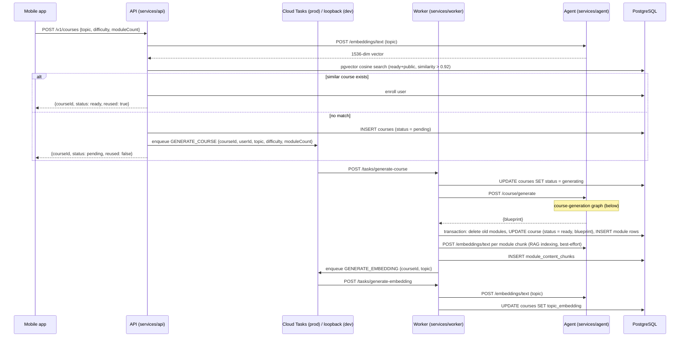
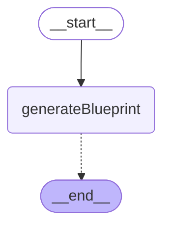
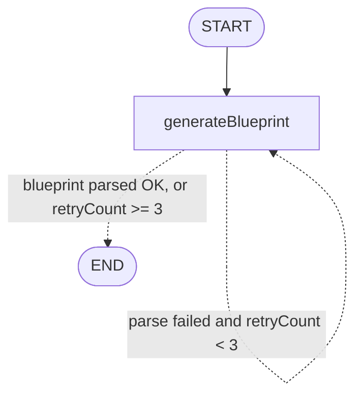

# Agent graphs — current course-generation flow (audit)

> Discovery audit for issue #88 (parent #84). Describes the system **as it exists today** — no proposed redesign. Verified against source on 2026-09-01.

The Agent service (`services/agent`) runs exactly two LangGraph graphs:

| Graph | Nodes | Checkpointer | Entry route |
|---|---|---|---|
| course-generation | 1 (`generateBlueprint`) | none (stateless per request) | `POST /course/generate` |
| module-chat | 2 (`teacher`, `evaluator`) | required (`ICheckpointerProvider`) | `POST /module-chat/stream` (SSE) |

Source of truth: `services/agent/src/graphs/course-generation/{graph,nodes,state}.ts` and `services/agent/src/graphs/module-chat/{graph,nodes,state}.ts`. Invariants live in the sibling `AGENTS.md` files — this doc describes, those files bind.

---

## End-to-end call path: API → Worker → Agent

Course generation is asynchronous and queue-driven. The mobile app never talks to the Agent; the Agent is internal-only (port 3001).



Key files per hop:

- API: `services/api/src/modules/courses/courses.service.ts` (`createOrReuse` — embedding, similarity reuse, insert `pending`, enqueue)
- Worker: `services/worker/src/processors/course-generation.processor.ts` (status lifecycle, ready-transaction, RAG indexing, follow-up enqueue); retry semantics in `services/worker/src/processors/AGENTS.md`
- Agent route: `services/agent/src/routes/generate-course.ts` (Zod-validates body, invokes graph, 500 on `blueprint: null`)
- RAG indexing (post-generation, tutoring only): `services/worker/src/rag/index-chunks.ts`

Status lifecycle (writer in parentheses): `pending` (API) → `generating` (Worker) → `ready` (Worker, inside the module-insert transaction) or `failed` (Worker, final task attempt only).

---

## Graph 1: course-generation

`services/agent/src/graphs/course-generation/graph.ts`

A single-node graph: **course generation today is one LLM call** that produces the entire blueprint of module *outlines* — no research step, no per-module content generation, no fan-out.

### Auto-generated diagram

Output of `graph.getGraph().drawMermaid()` on the compiled graph (see [Regenerating the diagrams](#regenerating-the-diagrams)):



> **Caveat (honest limitation):** the conditional edge is registered without an explicit path map, so LangGraph's renderer draws only the dashed edge to `__end__` and **omits the retry self-loop** (`generateBlueprint → generateBlueprint`). The annotated diagram below adds it; it is hand-drawn from `graph.ts` lines 18–22, not auto-generated.

Annotated (hand-drawn) topology:



### State shape (`state.ts`)

| Field | Type | Role |
|---|---|---|
| `topic` | `string` | Input |
| `difficulty` | `DifficultyLevel` | Input (`beginner`/`intermediate`/`advanced`) |
| `moduleCount` | `number` | Input (route validates 1–20) |
| `blueprint` | `CourseBlueprint \| null` | Output — validated, or `null` on failure |
| `retryCount` | `number` | Starts 0, +1 per failed parse |
| `error` | `string \| null` | Last Zod validation error message |

### Node: `generateBlueprint` (`nodes.ts`)

1. `llmProvider.getModel()` (provider chosen by `LLM_PROVIDER`; never hardcoded).
2. Builds messages: `COURSE_GENERATION_SYSTEM_PROMPT` + `buildCourseGenerationPrompt({topic, difficulty, moduleCount})` (both from `@autodidact/prompts`).
3. One LLM call via `invokeModel()` (`src/llm/resilient-invoke.ts` — per-attempt timeout, bounded backoff on 429/5xx/network, abort via `config.signal`, token-usage span attributes).
4. Extracts JSON (strips optional markdown fences), `CourseBlueprintSchema.safeParse()`.
5. Success → fills missing module `id`s with `crypto.randomUUID()`, returns `{ blueprint }`.
   Failure → `{ blueprint: null, retryCount: retryCount + 1, error }`.

### Edges

- `START → generateBlueprint` (unconditional)
- Conditional after `generateBlueprint`:
  - `state.blueprint` set → `END`
  - else `retryCount < 3` → `generateBlueprint` (retry — a full new LLM round trip)
  - else → `END` with `blueprint: null` (route returns 500; Worker's task retry/failure handling takes over)

### Model calls & cost profile

- **1 LLM call per attempt; up to 4 attempts** (initial + 3 validation retries) — each retry regenerates the *entire* blueprint with the identical prompt (no error feedback is fed back to the model).
- `invokeModel()` adds its own transport-level retries on 429/5xx inside each attempt.
- The single output must contain the full course: title, description, estimatedHours, and `moduleCount` modules each with objectives + contentOutline. Output size (and latency) scales linearly with `moduleCount` (up to 20). **This one call is the token/cost hotspot of generation.**
- No streaming — the Worker blocks on the full HTTP response.
- Compiled **without a checkpointer**: stateless per request, no multi-turn state.

---

## Graph 2: module-chat

`services/agent/src/graphs/module-chat/graph.ts`

Stateful multi-turn tutoring graph, checkpointed per session (`thread_id` = request `sessionId`; PostgreSQL checkpointer in prod, memory in dev via `CHECKPOINTER`).

### Auto-generated diagram

Output of `graph.getGraph().drawMermaid()` on the compiled graph — this one is complete as rendered:


Conditional after `teacher`: `state.completionSignaled === true` → `evaluator`, else `END`.

### State shape (`state.ts`)

| Field | Type | Role |
|---|---|---|
| `messages` | `BaseMessage[]` | Full history; append-only via `messagesStateReducer` |
| `moduleBlueprint` | `ModuleBlueprint` | Current module context (id, objectives, contentOutline) |
| `courseProgress` | `CourseProgressContext` | Course title + completed/total module counts |
| `completionSignaled` | `boolean` | Set by teacher on `[MODULE_COMPLETE:score=N]` detection |
| `completionScore` | `number \| null` | Preliminary score from marker; refined by evaluator |
| `teachingPhase` | `'introduction' \| 'teaching' \| 'evaluation'` | Set to `'evaluation'` on completion signal |

### Node: `teacher` (`nodes.ts`)

1. Optional RAG grounding (ADR-024, gated by `RAG_ENABLED`): retrieves top-4 `module_content_chunks` for the latest learner message via `ContentRetriever`; best-effort — any failure falls back to the un-grounded prompt.
2. System prompt: `buildModuleSystemPrompt(moduleBlueprint, courseProgress, retrievedContext?)`.
3. One LLM call via `invokeModel()` with `[system, ...messages]` — the **entire conversation history every turn** (no truncation or summarisation).
4. Scans output for `[MODULE_COMPLETE:score=N]`; if found, strips the marker (users must never see it), returns `completionSignaled: true`, `completionScore`, `teachingPhase: 'evaluation'`; else appends the `AIMessage` with `completionSignaled: false`.

Only teacher tokens stream to the client — the route (`src/routes/module-chat.ts`, SSE protocol source of truth) filters `streamMode: 'messages'` events on `langgraph_node === 'teacher'`.

### Node: `evaluator` (`nodes.ts`)

Runs only when completion is signaled. One LLM call: `COMPLETION_EVALUATOR_SYSTEM_PROMPT` + **full message history again** + `buildCompletionEvaluatorPrompt(objectives)`. Parses `{completed, score, feedback}` JSON; on parse failure falls back to `completionScore ?? 75`. Its raw JSON never reaches the SSE stream (node-name filter above).

### Model calls & cost profile

- Normal turn: **1 LLM call** (teacher) + optionally 1 embedding call (RAG query embedding inside the retriever).
- Completion turn: **2 LLM calls** (teacher + evaluator), both carrying the full history.
- **Hotspot: unbounded history growth** — every turn re-sends the whole conversation, so per-turn input tokens grow linearly with session length; the completion turn pays it twice.

---

## Embedding call sites (not graphs, but part of the flow's LLM spend)

`POST /embeddings/text` (OpenAI text-embedding-3-small, 1536-dim) is called from:

1. API `createOrReuse` — 1 call per course-creation request (similarity reuse gate).
2. Worker RAG indexing — 1 call **per module chunk**, sequentially, after generation (`index-chunks.ts`).
3. Worker embedding task — 1 call per generated course (topic embedding).
4. Agent RAG retriever — 1 call per grounded chat turn (query embedding).

---

## Regenerating the diagrams

The mermaid above is auto-generated from the compiled graphs (reproducible, not hand-drawn — except the annotated retry-loop diagram, labeled as such). To regenerate, drop this throwaway script into `services/agent/` and run it with the workspace built (`pnpm build`):

```ts
// print-mermaid.ts — run: ./node_modules/.bin/tsx print-mermaid.ts (from services/agent)
import { buildCourseGenerationGraph } from './src/graphs/course-generation/graph.js';
import { buildModuleChatGraph } from './src/graphs/module-chat/graph.js';
import type { ILLMProvider, ICheckpointerProvider } from '@autodidact/providers';

// getModel() is only called at node invocation time, never during build/compile.
const llmProvider = {
  getModel: () => { throw new Error('not invoked'); },
  getModelName: () => 'stub',
} as unknown as ILLMProvider;
const checkpointerProvider = { getCheckpointer: () => undefined } as unknown as ICheckpointerProvider;

console.log('=== course-generation ===');
console.log(buildCourseGenerationGraph(llmProvider).getGraph().drawMermaid());
console.log('=== module-chat ===');
console.log(buildModuleChatGraph(llmProvider, checkpointerProvider).getGraph().drawMermaid());
```

Delete the script after use (one-time scripts are disposable per repo policy).

---

## LangGraph Studio — recommendation

**Decision: do not wire LangGraph Studio now.** Rationale:

- Both graphs are trivial today (1 and 2 nodes); the committed mermaid plus the script above already make them fully legible and reproducible.
- Studio requires a `langgraph.json`, exported graph factories decoupled from the Fastify DI wiring (providers, retriever, logger are injected at boot), and the `@langchain/langgraph-cli` dev server — ongoing surface for near-zero insight at this size, against the repo's lean constraint.
- **Revisit when the #84 redesign lands a multi-node generation graph** (research/fan-out/per-module content). At that point Studio's step-through debugging and checkpoint inspection earn their keep; budget the `langgraph.json` + graph-export refactor into that work.
