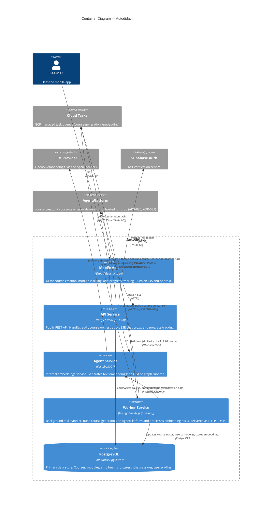

# C4 Level 2 — Containers

This diagram zooms into the Autodidact system and shows each deployable unit (container), its technology, and how containers communicate.



In local development the Cloud Tasks hop is replaced by the loopback queue provider: enqueue POSTs the payload straight to the worker's `/tasks/:name` endpoint over plain HTTP — the same contract, no queue service.

## Container Descriptions

### Mobile App
| | |
|---|---|
| **Technology** | Expo + React Native + TypeScript |
| **Routing** | Expo Router (file-based) |
| **State** | TanStack Query (server state), Zustand (auth session + streaming chat) |
| **Auth token** | Stored in Expo SecureStore via Zustand persist |
| **SSE** | `@microsoft/fetch-event-source` for streaming chat |
| **Network** | Talks only to API Service (never directly to Agent or Worker) |

### API Service
| | |
|---|---|
| **Technology** | NestJS + TypeScript |
| **Port** | 3000 (public, behind Cloud Run ingress) |
| **Auth** | `AuthGuard` verifies Supabase JWT on every protected route |
| **DI** | 4 feature modules: Auth, Courses, Chat, Progress. Queue provider injected by token. |
| **Chat** | One `course-teacher` run per learner turn on AgentPlatform, on a thread per session (`chat_sessions.thread_id`, ADR-031); the reply arrives whole and is written to a raw `@Res()` SSE response as a `token` event — not a proxy of a real Agent SSE stream |
| **Queue** | Creates `generate-course` tasks via `IQueueProvider` (Cloud Tasks / loopback) |

### Agent Service
| | |
|---|---|
| **Technology** | Fastify + TypeScript |
| **Port** | 3001 (**internal only** — not publicly accessible) |
| **Runs** | `POST /embeddings/text` only. No graph, checkpointer, or LLM chat call (ADR-030 moved course generation off, ADR-031 moved module teaching off) |

### Worker Service
| | |
|---|---|
| **Technology** | Node.js + Fastify (internal HTTP task handler) |
| **Endpoints** | `POST /tasks/generate-course`, `POST /tasks/generate-embedding`, `GET /health` |
| **Task chaining** | After course generation completes, creates the `generate-embedding` task automatically |
| **Course generation** | Creates and polls a run on AgentPlatform's `course-creator` workflow via `AgentPlatformClient` (`AGENT_PLATFORM_URL`, ADR-030) — reachable from dev only until the platform is hosted for prod |
| **Retries** | Queue-level (Cloud Tasks `retry_config`: 3 attempts, 5 s → 125 s backoff); final failed attempt marks the course `failed` |
| **Deployment** | Cloud Run, scale-to-zero; invoked by Cloud Tasks with an OIDC token (IAM-authenticated) |

### PostgreSQL (Supabase)
| | |
|---|---|
| **Extension** | `pgvector` for 1536-dimensional topic embeddings and RAG content chunks |
| **RLS** | Row Level Security applied in migration 0003 |
| **Access** | API and Worker via `DATABASE_URL` (Drizzle ORM). Agent does not touch Postgres. |
| **Schema** | 6 tables: `users`, `courses`, `modules`, `enrollments`, `module_progress`, `chat_sessions` |

## Communication Map

| From | To | Protocol | Description |
|------|----|----------|-------------|
| Mobile | API | HTTPS REST | Course creation, listing, enrollment, progress, generation-status polling |
| Mobile | API | HTTPS SSE | Chat message streaming |
| API | Agent | HTTP POST | Embedding generation (similarity check, RAG query) |
| API | AgentPlatform | HTTPS `/api/v1` | Create a thread, run `course-teacher` per learner turn (ADR-031) |
| API | Cloud Tasks | HTTPS | Create `generate-course` task |
| Cloud Tasks | Worker | HTTPS POST (OIDC) | Deliver tasks to `/tasks/:name` |
| Worker | Cloud Tasks | HTTPS | Create `generate-embedding` follow-up task |
| Worker | AgentPlatform | HTTPS `/api/v1` | Create + poll a `course-creator` run (ADR-030) |
| Worker | Agent | HTTP POST | `/embeddings/text` |
| Worker | PostgreSQL | SQL | Update course status, insert modules, store embeddings |
| Agent | LLM Provider | HTTPS | Embedding generation only |

## Network Boundaries

```
Internet
  └── Cloud Run (public ingress)
        └── API Service (:3000)
              ├── → Agent Service (:3001)  [Cloud Run internal]
              ├── → AgentPlatform          [dev-only loopback until hosted for prod, ADR-031]
              ├── → Cloud Tasks            [GCP API]
              └── → Supabase PostgreSQL    [external managed]
Worker Service  [Cloud Run internal; inbound only from Cloud Tasks via IAM-verified OIDC]
              ├── → Agent Service
              ├── → AgentPlatform          [dev-only loopback until hosted for prod, ADR-030]
              ├── → Cloud Tasks
              └── → Supabase PostgreSQL
```

---

_Previous: [C4 Level 1 — Context](c4-context.md) | Next: [C4 Level 3 — Components](c4-components.md)_
