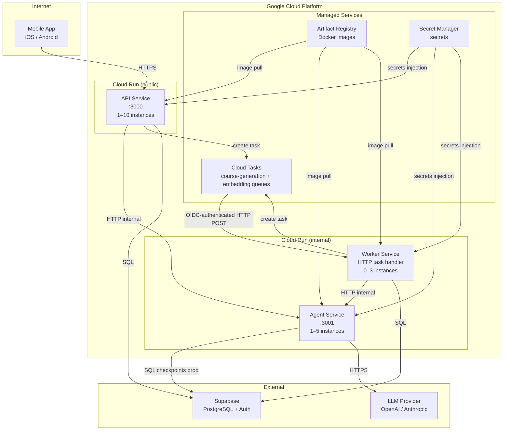

# Infrastructure

Autodidact runs entirely on Google Cloud Platform. All compute is Cloud Run (serverless containers). Infrastructure is defined as code using Terraform.

---

## Topology



---

## Cloud Run Service Configuration

| Service | Public | CPU | Memory | Min | Max | Notes |
|---------|--------|-----|--------|-----|-----|-------|
| `api` | Yes | 1 | 512 Mi | 1 | 10 | Public ingress; scales with traffic |
| `agent` | No | 2 | 2 Gi | 1 | 5 | Higher memory for LangGraph + LLM responses |
| `worker` | No | 1 | 512 Mi | 0 | 3 | Scale-to-zero HTTP task handler; invoked by Cloud Tasks with an OIDC token (IAM `run.invoker` on the runtime service account) |

Background work flows through **Cloud Tasks** ([ADR-027](ADRs/services/worker/ADR-027-background-job-queue-cloud-tasks.md)): two queues (`autodidact-course-generation`, `autodidact-embedding`) with queue-level retry config (3 attempts, 5 s → 125 s backoff), defined in `infra/modules/cloud-tasks`.

Cloud Run services use a dedicated service account (`autodidact-run`) with least-privilege IAM bindings.

---

## Secret Management

Secrets are stored in **GCP Secret Manager** and injected as environment variables at container startup. No secrets are baked into images or committed to the repository.

| Secret Name | Used By | Description |
|-------------|---------|-------------|
| `DATABASE_URL` | api, worker, agent (prod) | PostgreSQL connection string |
| `SUPABASE_URL` | api, agent | Supabase project URL |
| `SUPABASE_SECRET_KEY` | api, worker | Supabase admin access |
| `OPENAI_API_KEY` | agent | OpenAI API key |
| `ANTHROPIC_API_KEY` | agent | Anthropic API key (optional) |
| `OTEL_EXPORTER_OTLP_ENDPOINT` | api, agent, worker | Trace exporter (optional) |
| `AGENT_SERVICE_URL` | api, worker | Internal URL of Agent service |
| `WORKER_TASK_BASE_URL` | api, worker | Worker Cloud Run URL targeted by Cloud Tasks (set after the worker's first deploy) |
| `QUEUE_PROVIDER` | api, worker | Queue provider selector — must be `cloudtasks` in prod (a stale `bullmq` value fails service boot) |

Non-secret Cloud Tasks config (`GCP_PROJECT_ID`, `CLOUD_TASKS_LOCATION`, `CLOUD_TASKS_INVOKER_SA`) is injected as plain env vars from Terraform, not Secret Manager.

---

## Terraform Structure

```
infra/
├── backend.tf                    # GCS state backend (autodidact-terraform-state)
├── providers.tf                  # google provider ~> 5.0
├── environments/
│   └── prod/
│       ├── main.tf               # Wires all modules together, configures secrets
│       └── variables.tf          # project_id, region, service_account_name
└── modules/
    ├── artifact-registry/        # Creates Docker registry
    ├── cloud-run-service/        # Reusable Cloud Run module (scaling, secrets, IAM)
    └── cloud-tasks/              # Task queues + enqueuer/OIDC IAM (ADR-027)
```

**State**: Remote in GCS bucket `autodidact-terraform-state`. Terraform >= 1.9.0.

To deploy:
```bash
cd infra/environments/prod
terraform init
terraform plan -var="project_id=YOUR_PROJECT"
terraform apply -var="project_id=YOUR_PROJECT"
```

---

## CI/CD Pipeline

GitHub Actions handles validation on pull requests and full deployment on push to `master`.

```
pull request / push to master
  ├── lint + typecheck (all packages)
  └── test (all packages)

push to master / manual deploy dispatch
  ├── lint + typecheck (all packages)
  ├── test (all packages)
  ├── Docker build + push → Artifact Registry
  │     (api, agent, worker — parallel)
  ├── pnpm --filter @autodidact/db db:migrate
  │     (runs against production DATABASE_URL)
  └── Cloud Run deploy
        (api, agent, worker — parallel)
```

**Authentication**: Workload Identity Federation — GitHub Actions authenticates to GCP without service account key files. The federation is configured in Terraform and bound to the `autodidact-run` service account.

Required GitHub repository variables:

| Name | Purpose |
|------|---------|
| `GCP_PROJECT_ID` | GCP project that owns Artifact Registry and Cloud Run |
| `GCP_REGION` | GCP region, defaults to `us-central1` if omitted |
| `GCP_WORKLOAD_IDENTITY_PROVIDER` | Full Workload Identity Provider resource name |
| `GCP_SERVICE_ACCOUNT` | Deploy service account email |

Required GitHub environment secret for the `production` environment:

| Name | Purpose |
|------|---------|
| `PROD_DATABASE_URL` | Production database URL used by Drizzle migrations |

---

## Local Development

| Concern | Local | Production |
|---------|-------|------------|
| PostgreSQL | Docker (`pgvector/pgvector:pg16`) | Supabase managed |
| Task queue | Loopback provider (direct HTTP POST to the worker) | GCP Cloud Tasks |
| LLM | OpenAI API (same) | OpenAI or Anthropic |
| Auth | Supabase (same project) | Supabase (same project) |
| Checkpointer | `MemorySaver` (in-process) | `PostgresSaver` (DB) |
| Secrets | `.env` file | GCP Secret Manager |
| Services | `pnpm dev` (ts-node watch) | Docker containers on Cloud Run |

Start local infrastructure:
```bash
docker compose up -d      # starts Postgres
pnpm --filter @autodidact/db db:migrate
pnpm dev                  # starts api + agent + worker in watch mode
```
