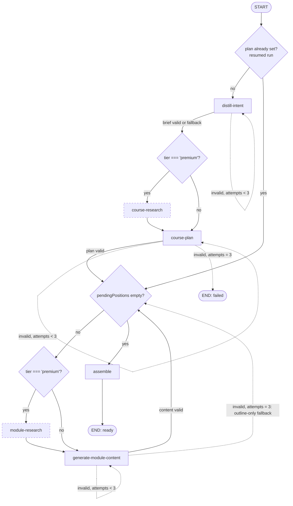

# Course Gen — Design the target multi-node generation graph

**Date:** 2026-09-10
**Status:** Draft — pending owner review (issue #89, epic #84). Decision recorded in [ADR-030](../../../architecture/ADRs/services/agent/ADR-030-course-generation-graph-execution-model.md); this spec is the implementer's reference for #91–#96. Revised after cold review (2026-09-10): overlapping-attempt fence, resume persistence, event semantics, invariant updates.
**Position:** Design only — no code. Today's system is described in [`agent-graphs.md`](../../../architecture/agent-graphs.md) (#88 audit) and is not restated here.

> **Reading order:** ADR-030 (why one streamed sequential graph) → this spec (what to build) → the build issues (#91 distill, #92 plan + loop, #93 research, #94 tier wiring, #95 payment, #96 mobile).
> **Explicitly not decided here** (see [Needs David](#needs-david)): premium price and model-per-tier (#90), payment (#95), research vendor (#93 — candidates and a recommendation below).

---

## 1. Goal, non-goals, settled inputs

**Goal.** Replace the single `generateBlueprint` call with one LangGraph graph that distills the learner's intent, optionally researches online, plans the course, generates each module's real teaching content one by one (optionally researching each), and assembles the result — streaming stage events so the Worker persists progress and partial results, and resumes on retry.

**Non-goals.** Tier economics, payment, research vendor choice, mobile UI, prompt wording, LangGraph 1.x upgrade (ADR-023), parallel module generation (follow-up, ADR-030 Rationale).

**Settled by #84 (owner's words), used as requirements here:**
- Stages: distill → research → plan → "module creation one by one with a node that does research". Modules are generated **sequentially**; whether the coherence gain justifies the wall-clock cost is unmeasured (Needs David #2 asks to confirm, and §12 adds the eval that would settle it).
- Tier difference is **research only**: "cheaper free courses don't have the online research nodes". Both tiers therefore produce full `ModuleContent`; the free tier does it with the cheaper model chosen in #90. (#92's acceptance — "modules with real teaching content" — is tier-agnostic.)

---

## 2. Topology

Premium run (every node). Dashed nodes are skipped when `tier === 'free'`.



Free run, for legibility: `distill-intent → course-plan → { generate-module-content }×M → assemble`.

| Node | LLM calls | Research calls | May fail the course? |
|---|---|---|---|
| `distill-intent` | 1 (+≤2 validation retries) | 0 | No — deterministic fallback brief |
| `course-research` | 0 | ≤3 | No — degrades to "no research" |
| `course-plan` | 1 (+≤2 validation retries) | 0 | **Yes** — nothing to build without a plan |
| `module-research` | 0 | 1 per module | No — degrades per module |
| `generate-module-content` | 1 per module (+≤2 retries) | 0 | No — outline-only fallback per module |
| `assemble` | 0 | 0 | Only if **every** module fell back to outline-only |

Totals per course with M modules: free = `2 + M` LLM calls; premium = `2 + M` LLM calls + `≤ 3 + M` research calls (before retries). Latency is the sum of node latencies (sequential loop). **No per-module latency has been measured yet**; §9 makes the premium `moduleCount` cap a measured decision inside #92, after #90 picks the models.

Every node is wrapped with `instrumentNode` (existing); add `attempts` to its `SIGNAL_KEYS` so retries show on spans.

---

## 3. Graph state (`state.ts`)

`Annotation.Root`, one field per row. Reducer column: blank = last-write-wins (LangGraph default). The route maps the HTTP request onto the initial state exactly as it does today (`blueprint: null, retryCount: 0` becomes the table below); on a resumed run it pre-populates `plan`, `courseResearch`, `pendingPositions` and `moduleSummaries` from the request's `resume` object — **conditional edges only route, they never write state**.

| Field | Type | Set by | Reducer | Role |
|---|---|---|---|---|
| `courseId` | `string` | input | | Correlation only (logs, events); the graph never touches the DB |
| `topic` | `string` | input | | Raw learner input |
| `difficulty` | `DifficultyLevel` | input | | Pedagogical level (unchanged meaning) |
| `moduleCount` | `number` | input | | Requested module count; `course-plan` must produce exactly this many |
| `tier` | `'free' \| 'premium'` | input | | Gates research edges and model selection (#90 hook) |
| `brief` | `LearningBrief \| null` | `distill-intent` | | Structured intent every downstream prompt consumes |
| `courseResearch` | `ResearchDigest \| null` | `course-research` (or resume input) | | Subject-level sources + notes; `null` = not run / degraded |
| `plan` | `CourseBlueprint \| null` | `course-plan` (or resume input) | | The module skeleton — same schema as today's blueprint plus `brief` and `research` |
| `pendingPositions` | `number[]` | `course-plan` (or resume input) / loop | | Positions still to generate, in order. Head = current module |
| `moduleResearch` | `ResearchDigest \| null` | `module-research` | | Scratch for the current module; reset to `null` when the loop advances |
| `modules` | `GeneratedModule[]` | `generate-module-content` | append (`(a, b) => a.concat(b)`) | Accumulated results: `{ position, content: ModuleContent \| null, contentStatus: 'full' \| 'outline_only' }` |
| `moduleSummaries` | `{position, summary}[]` | `generate-module-content` (or resume input) | append | One-paragraph summaries fed to later modules for coherence |
| `attempts` | `number` | each LLM node | | Validation attempts for the *current* node/module; reset to `0` on node success and on loop advance |
| `lastError` | `string \| null` | each node | | Last Zod issue text, fed back into the retry prompt |
| `result` | `AssembledCourse \| null` | `assemble` | | Final `{ title, description, estimatedHours, degradedPositions }` |

`retryCount`/`blueprint`/`error` from today's state are replaced by `attempts`/`plan`/`lastError`.

---

## 4. Shared contracts (`packages/schemas`, mirrored in `packages/types`)

New Zod schemas; keep each minimal. Prompts instruct JSON-only output as today; nodes strip fences and `safeParse`. **`JSON.parse` must be inside the validation path** — today a malformed body throws out of the node instead of counting as a validation failure (and the course-generation `AGENTS.md` anti-pattern that says otherwise is retired in §11).

```ts
LearningBrief {
  goal: string                      // one sentence, what the learner wants to be able to do
  audience: string                  // assumed prior knowledge, from `difficulty` + topic
  scope: { include: string[]; exclude: string[] }
  outcomes: string[]                // measurable outcomes; may be [] (the deterministic fallback cannot invent them)
  searchQueries: string[]           // 1–3 queries for course-research (premium)
}

ResearchDigest {
  query: string
  sources: { url: string; title: string; snippet: string; publishedAt?: string }[]  // ≤ 8
  notes: string                     // provider answer/summary if offered, else concatenated snippets, capped (see §5)
}

ModuleContent {
  summary: string                   // 1 paragraph; also becomes the module's entry in moduleSummaries
  sections: { title: string; body: string }[]   // body = markdown; one section per contentOutline entry; ≥ 1
  keyTakeaways: string[]            // 3–6
  sources: { url: string; title: string }[]     // citations from module/course research; [] for free
}

CourseBlueprint (existing) + brief?: LearningBrief + research?: ResearchDigest   // plan snapshot; modules stay outline-shaped
ModuleBlueprint (existing)                                                       // unchanged

GenerateCourseRequest = CourseGenerationJobData + { tier: Tier; attemptId: string; resume?: ResumeInput }
ResumeInput = { blueprint: CourseBlueprint; completedModules: { position: number; summary: string }[] }
Tier = 'free' | 'premium'                    // enum lands in #90; default 'free' everywhere until #94 threads it
```

`CourseBlueprint` remains the plan snapshot stored in `courses.blueprint` (small: outlines + brief + course research digest). **Once persisted it is immutable for that course** — a resumed run never re-plans. Full module content lives **only** in `modules.content` — never duplicated into the blueprint.

---

## 5. Node contracts

Common rules: every LLM call goes through `invokeModel(model, messages, { signal: config.signal, node, modelName, timeoutMs })`; prompts come from `@autodidact/prompts` (new builders in `course-generation.ts`); models from `llmProvider.getModel(...)`. On a validation failure the node returns `{ attempts: attempts + 1, lastError }` and the retry prompt appends *"Your previous answer failed validation: <lastError>. Return corrected JSON only."* — cheaper than today's identical re-send.

**Per-node `timeoutMs`:** `invokeModel`'s default is 60 s per attempt, sized for outline output. `generate-module-content` produces markdown bodies and gets **180 s** per attempt; other nodes keep the default. Both live as constants next to the node factories, tuned from the §9 measurement.

**Model-per-tier hook (decided in #90, reserved here):** nodes call `llmProvider.getModel({ tier, node })`. Until #90 lands, the existing zero-arg `getModel()` is called and the argument is ignored.

### `distill-intent`
- **In:** `topic`, `difficulty`, `moduleCount`. **Out:** `brief`, `attempts: 0`.
- Validation: `LearningBriefSchema`. Retries: ≤2 (3 attempts).
- **Fallback (never fails the course):** on the 3rd failure emit a deterministic, schema-valid brief — `goal = topic`, `audience` from `difficulty`, `scope = { include: [topic], exclude: [] }`, `outcomes = []`, `searchQueries = [topic]` — and continue. Log at `warn`.

### `course-research` (premium only)
- **In:** `brief.searchQueries`. **Out:** `courseResearch`.
- One `researchProvider.search(query, { maxResults: 8, timeoutMs: 15_000 })` per query (≤ 3); merge, dedupe by URL, keep ≤ 8 sources; `notes` capped at a prompt-package constant (~4 000 characters, an input-token bound).
- No LLM call. Provider errors → `courseResearch: null`, `warn` log, continue.

### `course-plan`
- **In:** `brief`, `courseResearch`, `difficulty`, `moduleCount`. **Out:** `plan` (with `brief` and `research` embedded), `pendingPositions = [0..moduleCount-1]`, `attempts: 0`.
- Validation: `CourseBlueprintSchema` **and** `modules.length === moduleCount` with positions `0..n-1` (today only the schema is checked). Module ids are not assigned in the graph any more — the Worker owns row ids (§7.2); `ModuleBlueprintSchema.id` stays optional and ignored (schemas `AGENTS.md` already says it is discarded).
- Retries: ≤2 (3 attempts, preserving today's resilience). **On the 3rd failure the graph ends with `plan: null`** → route emits `error` → Worker throws → Cloud Tasks retry (nothing persisted yet, so a full re-run is correct and cheap).

### `module-research` (premium only)
- **In:** current module's `title` + `objectives` (from `plan`), `brief.goal`. **Out:** `moduleResearch`.
- One `search` call, ≤ 6 sources. Same degrade rule as `course-research`.

### `generate-module-content`
- **In:** current module blueprint, `brief`, `courseResearch`, `moduleResearch`, `moduleSummaries` (previous modules), `difficulty`. **Out:** appends to `modules` and `moduleSummaries`, pops head of `pendingPositions`, `moduleResearch: null`, `attempts: 0`.
- Validation: `ModuleContentSchema`. Retries: ≤2.
- **Fallback (never fails the course):** on the 3rd failure append `{ position, content: null, contentStatus: 'outline_only' }` and a summary built from the module description; advance the loop. The module row keeps its outline; the teacher prompt already works from outlines. A degraded position is **final for this run and for resumed runs** (§7.2) — a retry never re-bills it; re-generating degraded modules is a separate product action (Needs David #4).

### `assemble`
- Pure (no LLM, no I/O). **In:** `plan`, `modules`. **Out:** `result = { title, description, estimatedHours: ceil(Σ estimatedMinutes / 60), degradedPositions }`.
- If **every** module is `outline_only` → `result: null` (course fails; §7.2). Otherwise ready. Tier-independent because both tiers generate content (§1).

---

## 6. Conditional edges

| After | Condition | Target |
|---|---|---|
| `START` | `plan === null` (fresh run) | `distill-intent` |
| `START` | `plan !== null` (resumed run; route pre-populated state) | loop check |
| `distill-intent` | `brief !== null` (valid or fallback) and `tier === 'premium'` | `course-research` |
| `distill-intent` | `brief !== null` and `tier === 'free'` | `course-plan` |
| `distill-intent` | `brief === null && attempts < 3` | `distill-intent` |
| `course-research` | always | `course-plan` |
| `course-plan` | `plan !== null` | loop check |
| `course-plan` | `plan === null && attempts < 3` | `course-plan` |
| `course-plan` | `plan === null && attempts >= 3` | `END` |
| loop check | `pendingPositions.length > 0 && tier === 'premium'` | `module-research` |
| loop check | `pendingPositions.length > 0 && tier === 'free'` | `generate-module-content` |
| loop check | `pendingPositions.length === 0` | `assemble` |
| `module-research` | always | `generate-module-content` |
| `generate-module-content` | invalid & `attempts < 3` | `generate-module-content` |
| `generate-module-content` | valid, or fallback applied | loop check |

"Loop check" is the routing function attached to `course-plan`, `generate-module-content` and the resumed-`START` case — not a node. Register every conditional edge **with an explicit path map** so `drawMermaid()` renders all edges (the #88 audit noted the retry self-loop is otherwise invisible). Node `retryPolicy` (available in 0.2.74) is **not** used: transient errors are already retried inside `invokeModel`, and validation retries need state (`lastError`) that a thrown-error policy cannot carry.

---

## 7. Streaming contract, Worker persistence, overlapping attempts

### 7.1 Agent route `POST /course/generate` → `text/event-stream`

The route runs `graph.stream(input, { streamMode: 'updates' })` and maps each node's **completion** to a typed event (`updates` emits when a node finishes; nothing is emitted "on start"). Same mechanics as `module-chat.ts`: headers, `reply.raw.write`, `reply.raw.end()` in `finally`, `reply.raw.on('close')` → abort the graph via `config.signal`. Errors go through `toErrorEvent()` (agent invariant).

| Event | Payload | Emitted when |
|---|---|---|
| `stage` | `{ completed: 'distill' \| 'course_research' \| 'plan' \| 'module_research' \| 'assemble', moduleIndex? }` | the named node finishes (`module_research` carries the position it researched) |
| `plan` | `{ blueprint: CourseBlueprint }` | `course-plan` succeeds (with the `stage: plan` event) |
| `module` | `{ position, content: ModuleContent \| null, contentStatus, remaining: number }` | each `generate-module-content` completion (valid or fallback) |
| `done` | `{ result: AssembledCourse }` | `assemble` |
| `error` | `{ code, message }` (safe, via `toErrorEvent`) | any thrown error, `plan === null`, or `result === null` |
| *(comment line `: ping`)* | — | every 15 s while the stream is open (heartbeat; `setInterval` cleared in `finally`) |

The stream always terminates with exactly one `done` or one `error`. Progress is therefore expressed as **what has completed**; the consumer labels the next step (deterministic given tier and `remaining`). No JSON (non-streaming) mode: Agent and Worker deploy together from the same promotion, so the contract flips in one PR (#92).

### 7.2 Worker (`course-generation.processor.ts`)

```
0. attemptId = randomUUID()                                   — this attempt's write token
1. UPDATE courses SET status='generating',
        generation_progress = jsonb_set(coalesce(progress,'{}'), '{attemptId}', attemptId)
   WHERE id = courseId AND status IN ('pending','generating')  — claim; 0 rows → course already ready/failed → return 204
2. Load resume state: blueprint (courses.blueprint) + module rows WHERE content IS NOT NULL,
   plus generation_progress.degradedPositions
   → resume = undefined when blueprint IS NULL, else { blueprint, completedModules: [...filled, ...degraded (summary = description)] }
3. agentClient.streamCourse({ ...payload, tier, attemptId, resume }, { signal }) — SSE reader over fetch body;
   `signal` aborts when the Worker's own request closes (req.raw 'close') or on stall (no bytes for 60 s)
     on plan   → tx: UPDATE courses SET title, description, difficulty, estimatedHours, blueprint, generation_progress
                     WHERE id AND progress->>'attemptId' = attemptId;
                   INSERT modules (position, title, description, objectives, contentOutline, estimatedMinutes)
                     ON CONFLICT (course_id, position) DO UPDATE SET <outline cols>
     on module → UPDATE modules SET content WHERE course_id AND position AND <fence>;
                 UPDATE courses SET generation_progress = { completed, moduleIndex, moduleTotal, degradedPositions } WHERE <fence>
     on stage  → UPDATE courses SET generation_progress WHERE <fence>
     on done   → UPDATE courses SET status='ready', estimatedHours, generation_progress (final) WHERE <fence>
     any fenced UPDATE affecting 0 rows → a newer attempt owns the course: abort the stream, return 204 (do NOT throw)
     on error / stream ended without done → throw (→ 500 → Cloud Tasks retry; final attempt → markCourseFailed, unchanged)
4. RAG indexing (best-effort, unchanged placement) — chunker prefers content.sections[].body, falls back to outline
5. enqueue GENERATE_EMBEDDING                                                            (unchanged)
```

`<fence>` = `courses.generation_progress->>'attemptId' = attemptId` (module updates join through the course row or carry the same predicate via a sub-select).

**Why the fence exists.** Cloud Run does not kill a handler when the client (Cloud Tasks) gives up at `dispatchDeadline`; it only severs the response. Without a fence, attempt 2 starts while attempt 1 is still streaming and both write the same course — duplicate spend, flapping progress, two `done`s, two embedding tasks. The claim in step 1 plus fenced writes make the **newest attempt the only writer**; the older one notices on its next write and stops. The Worker also aborts the Agent stream when its own request closes, which is the common case, and the Agent's `'close'` handler aborts the graph — so the older attempt usually stops within one node. Timeout ordering in §9 keeps the windows short.

**Idempotency:** delete-then-insert is replaced by upsert on the new unique index `(course_id, position)`; module row ids are stable across retries (the `module_progress` FK needs that once enrollments exist). Because `courses.blueprint` is immutable once written (§4), skeleton rows are never orphaned.

**Status lifecycle:** unchanged 4-state enum (`pending → generating → ready | failed`). Granularity lives in `courses.generation_progress`; the API's `getGenerationStatus` returns it alongside `status` — the mobile app already polls that endpoint every 2 s (`useGenerationStatus`), so per-event writes (≈ `M + 4` per course) are the right granularity. Readers keep gating on `status = 'ready'` (a `generating` course may have some modules filled).

**Degraded courses:** `ready` with `generation_progress.degradedPositions ≠ []`. What that means for a *paid* course is a payment-policy question (Needs David #4).

---

## 8. Schema changes (`packages/db`, hand-written migration `0014_*.sql` per db `AGENTS.md`)

| Change | Why |
|---|---|
| `modules.content jsonb NULL` (`$type<ModuleContent>`) | Full teaching content. `NULL` = outline-only (legacy rows and fallback modules) — every reader must handle it |
| `CREATE UNIQUE INDEX modules_course_id_position_key ON modules(course_id, position)` | Upsert target; replaces the non-unique `modules_course_id_position_idx` from `0002`. The migration first **asserts** no duplicate `(course_id, position)` exists (`DO $$ … RAISE …`) rather than deleting silently — today's delete-then-insert makes duplicates impossible in practice, and a loud failure is the right response if that assumption is wrong |
| `courses.generation_progress jsonb NULL` | `{ attemptId, completed, moduleIndex, moduleTotal, degradedPositions, updatedAt }`, written by the Worker only |
| `course_tier` enum (`free`, `premium`) + `courses.tier NOT NULL DEFAULT 'free'` | Landed by #94 (separate migration, no ordering dependency) |

Not changed: `courses.blueprint` (still the plan snapshot, now with `brief` + `research`), `modules.content_outline` (still produced by the plan; still the teacher's and chunker's fallback), `modules.status` (learner-locking default — never generation state, db invariant), `course_status` enum.

`chunkModuleContent` (worker `rag/chunk.ts`): when `content` is present, chunk = intro + objectives + one chunk per `content.sections[]` body (split bodies over ~1 500 characters); else today's outline chunks. Its local `ModuleContent` type alias is renamed to avoid clashing with the shared schema.

---

## 9. Infra and timeouts (lands with #92, before the loop is enabled in prod)

Ordering matters — each layer must give up **before** the one outside it, so a dead client is noticed by the inner layer first:

| Layer | Setting | Value | Where |
|---|---|---|---|
| Cloud Tasks task | `dispatchDeadline` | **1500 s** | `CloudTasksQueueProvider.createTask` — add `dispatchDeadlineSeconds?: number` to `EnqueueOptions` (today `enqueue` ignores `opts`) and set it for `GENERATE_COURSE` |
| Worker Cloud Run | request `timeout` | **1600 s** | new `timeout` variable on `infra/modules/cloud-run-service` (default today: 300 s) |
| Agent Cloud Run | request `timeout` | **1700 s** | same variable |
| Worker → Agent stream | stall abort | no bytes for **60 s** (heartbeat every 15 s) | `AgentClient.streamCourse` |
| Worker request | client close | abort Agent stream | `app.ts`: `req.raw.on('close')` → `AbortController` |

The 1800 s Cloud Tasks ceiling is the hard bound on a sequential run. **Premium `moduleCount` cap is set inside #92 from measurement**: generate 10 topics with full `ModuleContent` on the #90 models, take p95 per module, and cap premium at `floor(1200 s / p95_module)` (leaving distill/research/plan headroom); free keeps ≤ 20 until the same measurement says otherwise. Needs David #3 asks for the fallback number if measurement is deferred.

---

## 10. Research provider (`packages/providers`) — interface decided, vendor for #93

```ts
IResearchProvider { search(query: string, opts?: { maxResults?: number; timeoutMs?: number }): Promise<ResearchDigest> }
createResearchProvider(config) → RESEARCH_PROVIDER = 'none' | 'mock' | <the one vendor #93 picks>
```

`'none'` (default until #93) makes `course-research`/`module-research` return `null` immediately, so the premium path is testable without a vendor key. `mock` returns fixtures (matches the existing mock providers). The union grows only when a second vendor actually lands (lean rule — no speculative enum values). The research nodes are the **only** place `IResearchProvider` is used; the LLM never calls a search tool itself (keeps research a visible node and vendor-neutral, ADR-009).

| Candidate | Fit for "evidence for a course" | Price (vendor pages, 2026-09) | Notes |
|---|---|---|---|
| **Tavily** (recommended) | Built for agent RAG: returns LLM-ready snippets + optional answer; `include_domains`; official `@langchain/tavily` | $0.008/credit PAYG; basic search 1 credit, advanced 2; 1 000 free credits/mo ([pricing](https://www.tavily.com/pricing), [credits](https://docs.tavily.com/documentation/api-credits)) | Free tier covers dev + evals; cheapest per premium course (≈ 3 + M credits) |
| Exa | Neural search strong on educational/long-form sources; `/contents` for full text | $7/1k searches; $1/1k pages contents; $10 free credits/mo ([pricing](https://exa.ai/pricing)) | Best source *quality* candidate; ~2× Tavily per call |
| Brave Search API | Raw web results, cheap | $5/1k requests ([search summary](https://www.apipick.com/blog/best-web-search-apis-for-ai-agents-2026)) | Needs our own page extraction to be useful → more code |
| Perplexity Sonar | Answer-with-citations | $5/1k requests + tokens | Vendor writes the notes; less control over sources |
| Native model web-search tools (Anthropic/OpenAI) | Zero integration | $10/1k searches + tokens ([Anthropic docs](https://platform.claude.com/docs/en/agents-and-tools/tool-use/web-search-tool)) | Ties research to the LLM vendor, hides it inside the LLM call (no visible node), and is the most expensive per search |

Recommendation: Tavily first, Exa if source quality in evals is the differentiator. **Not decided here.**

---

## 11. Rollout — the single-node behaviour keeps working at every step

| Step | Issue | Lands | Compatibility invariant |
|---|---|---|---|
| 1 | #91 | `distill-intent` in front of today's `generateBlueprint`; `brief` embedded in the blueprint prompt and stored in `courses.blueprint.brief` | Response shape unchanged; Worker untouched; `brief` optional in the schema |
| 2 | #92a | Migration `0014` (`modules.content`, unique index, `generation_progress`); Worker upserts by position; `chunkModuleContent` content-aware; teacher prompt uses `content` when present | All columns nullable/defaulted → existing courses and the current single call keep working; Worker still consumes the JSON response |
| 3 | #92b | `course-plan` + loop + `assemble`, `generateBlueprint` deleted; SSE contract + heartbeat; Worker streaming client, claim/fence, resume; §9 timeouts; premium cap measurement | Agent + Worker flip together (same promotion). `tier` absent → `'free'` path |
| 4 | #93 | `IResearchProvider` + research nodes; `RESEARCH_PROVIDER=none` default | Premium path runs with research degraded until a vendor key is set |
| 5 | #90 → #94 | `tier` enum, model-per-tier hook, `courses.tier`, cost capture, request threading | Default `'free'` keeps every existing caller valid |
| 6 | #95, #96 | Payment; mobile tier selector + progress from `generation_progress` | — |

Rollback at any step = redeploy the previous promotion; no migration is destructive.

**Docs/invariants that change with step 3 (this repo enforces them — list them in the PR):**
- `services/agent/src/graphs/course-generation/AGENTS.md`: retire *Single node*, *Max 3 retries via `retryCount`*, *Module IDs in the node*, and the "do not catch `JSON.parse` errors" anti-pattern; keep *No checkpointer* (ADR-030 Option E explains why) and *Schema is the contract*; replace the state table with §3.
- `services/worker/AGENTS.md`: replace "module rows are inserted inside the same DB transaction as `status = 'ready'` — never split them" with the per-event, fenced persistence of §7.2 (`ready` is still written last and only by the Worker).
- `services/worker/src/processors/AGENTS.md`: processor steps, payload (`tier`, `attemptId`, `resume`), idempotency section.
- `docs/architecture/agent-graphs.md`: regenerate the mermaid from the compiled graph; wire LangGraph Studio (`langgraph.json` + exported graph factory) per the audit's trigger.
- `PRODUCTION.md` Agent/Worker sections (`_verified` bump) and `.env.example` (`RESEARCH_PROVIDER`).

---

## 12. Tests (Vitest, existing mock providers)

- Node unit tests (mirroring `course-generation.nodes.test.ts`): valid output, validation retry with error feedback, fallback after 3 attempts (and that the fallback brief parses against `LearningBriefSchema`), `JSON.parse` failure counted as validation failure.
- Graph tests: free path never invokes research nodes (spy on the research provider); premium path invokes both; a resumed input (plan + completed positions pre-populated) skips to the loop and generates only missing positions; `plan === null` after 3 attempts ends the graph; all-modules-degraded yields `result: null`.
- Route test: SSE event sequence for success and for error; heartbeat present; stream ends in `finally`; client close aborts the graph.
- Worker: processor integration test against real Postgres (existing pattern) with an SSE fixture — plan upserts skeleton rows, module fills content, `done` flips `ready`, an error mid-stream leaves `generating` + partial rows, a second run with resume completes without touching filled or degraded rows, **and an overlapping attempt: attempt 2 claims while attempt 1's fixture is mid-stream → attempt 1's next write affects 0 rows and it exits 204 without throwing**.
- Chunker: content-aware chunking vs outline fallback.
- Eval harness (`services/agent/src/eval`): (a) a scorer for `ModuleContent` presence/length so tier quality is measurable (#90 needs it); (b) a **coherence eval** — repetition/overlap between adjacent modules for sequential-with-summaries vs generated-from-plan-only on ~10 topics — the evidence behind Needs David #2.

---

## Needs David

1. **Premium price and model per tier** (#90) — the design only assumes `tier` gates research and passes `{ tier, node }` to `getModel`.
2. **Sequential generation: requirement or belief?** #84 says "one by one" and this spec builds that. If it is a belief, the §12 coherence eval can be run *before* #92b; a parallel-from-plan result would remove the 30-min ceiling, the premium cap and most of §9 (ADR-030 Option B).
3. **Premium `moduleCount` cap fallback** — §9 sets it from measurement inside #92. If you want a number before that: proposal premium ≤ 12, free ≤ 20.
4. **Degraded premium courses** — a `ready` premium course with some `outline_only` modules: accept, offer a one-tap regenerate of those modules, or refund? (touches #95). The design never re-bills them on retry.
5. **Reuse gate by tier** — may a free request be served an existing premium course (cheap win) and must a premium request never be served a free one? Current similarity reuse is tier-blind.
6. **Research vendor** (#93) — Tavily recommended; Exa if evals show source quality matters more than cost.
7. **Confirm "tier = research only"** (§1): both tiers get full module content, free on the cheaper model. The alternative — free stays outline-only, exactly today's output — would cut free-tier cost to 2 LLM calls per course but makes #92's content work premium-only.
